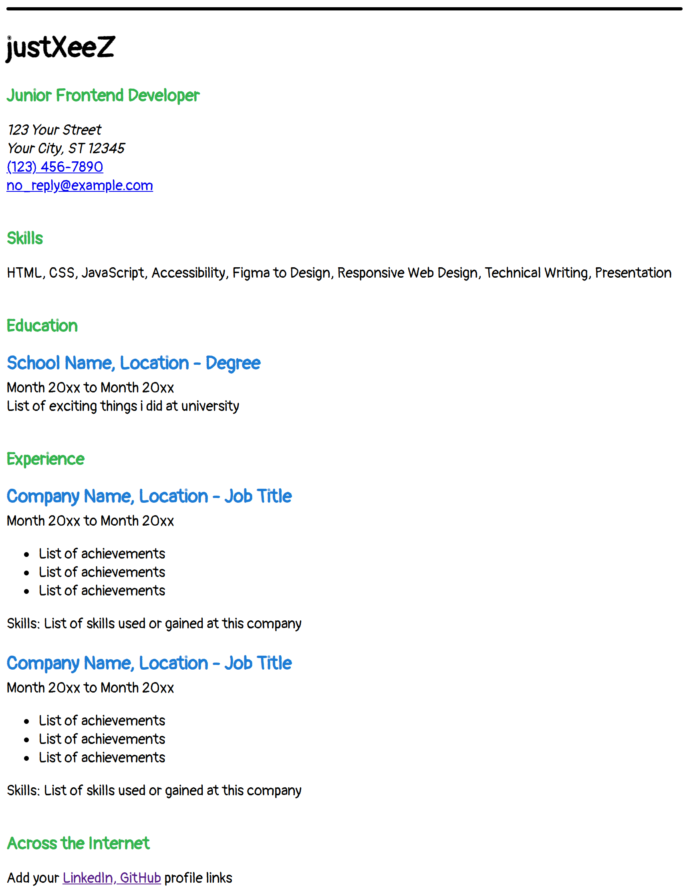

# Single-Page CV

## Preview of the project

## Notes
- This project was made for [Single-Page CV](https://roadmap.sh/projects/single-page-cv) on [roadmap.sh](https://roadmap.sh)

- The font used is [Pangolin](https://fonts.google.com/specimen/Pangolin) 

- Although CSS was not required for this project, I used it to get a similar look of the preview.
